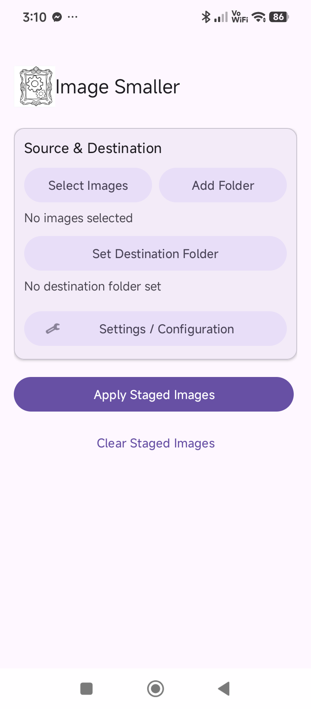
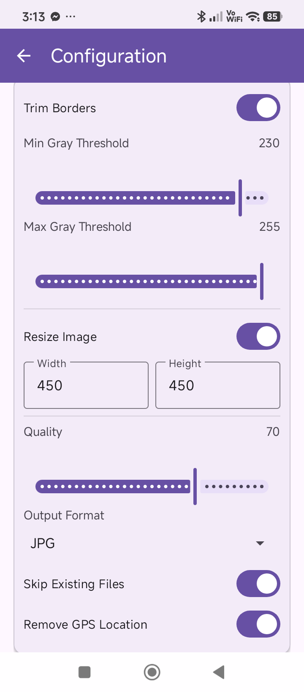
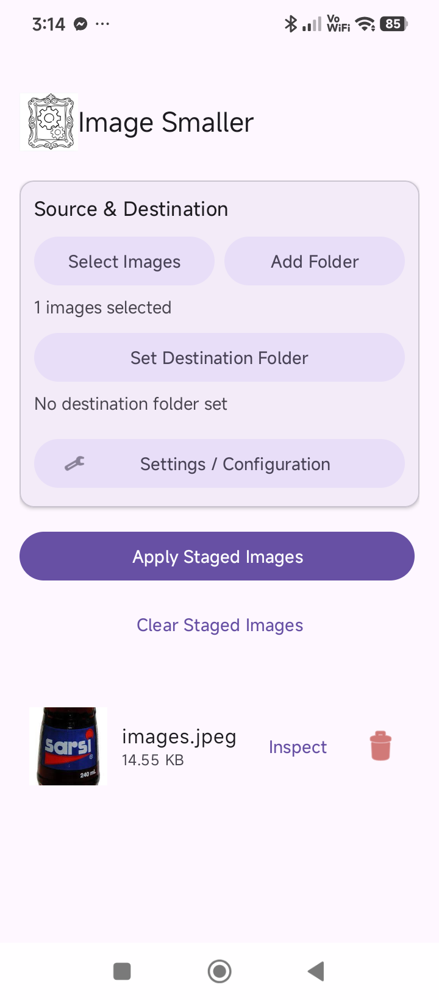

# ImageSmaller

ImageSmaller is a handy tool to shrink your images, making them easier to store and share without losing quality.

## 🚀 Live Demo & Download

👉 **[https://supercoolfire.github.io/ImageSmaller-Site/](https://supercoolfire.github.io/ImageSmaller-Site/)**

## 📱 App Preview

| Home Screen | Configuration | Processing |
| :---: | :---: | :---: |
|  |  |  |

## 📖 The Story & Purpose

This app was originally created as a small part of a larger system used for entering product data in e-commerce. Its main job was to fix photos sent by suppliers that weren't quite ready for a website.

Supplier photos often have messy borders (like black or white bars on the sides) or are in the wrong shape. To make them look professional, the app does two things:
- **Smart Trimming**: It automatically finds and cuts away those distracting black or white borders.
- **Auto-Square**: It crops and resizes the image into a perfect square (450x450), which is the standard look for online stores.

### Useful for Everyone
Even though it started as a tool for online sellers, it works great for anyone! If you don't need the trimming or resizing, you can just turn them off and use the app to make your personal photos much smaller in file size while keeping them looking sharp.

## ✨ Key Features

- **Smart Trimming**: Automatically cut out unwanted borders.
- **Batch Processing**: Fix or shrink hundreds of photos at once.
- **Privacy**: Option to remove location data hidden inside your photos.
- **Modern Formats**: Use space-saving formats like WebP to get even smaller files.
- **Easy to Use**: A simple, clean interface that anyone can understand.

---
© 2026 Machine Empire. Built with passion for better image management.
